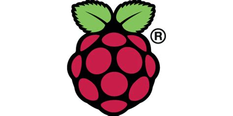
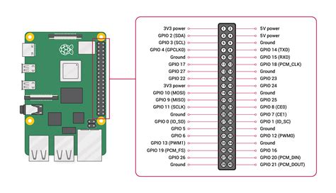
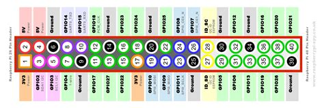

#Introduction To Raspberry Pi

The objective of this page is to help readers getting started with Raspberry Pi for projects relavent to Electronics Club, IIT Kanpur.

## Introduction

Raspberry Pi is series of low cost single borad computers which comes with built in features such as Wifi and Bluetooth and some USB and HDMI ports. We can connect a display, usb keyboard and mouse.

These mini computers are very flexible in the areas where these can be used such as embedded system, weather reports and small security system.

This is Raspberry Pi model 4:


## Getting Started

The document is divided into three section in relavence to the project and need.
The Subsections are as follows:

1. Installing Raspbian on Raspberry Pi 3

2. Using SSH(Secure Shell) remote access

3. Using VNC remote access

4. GPIO Programming

## Prerequisites

Before installing Raspbian on your Raspberry Pi,few prerequisite are as follow:

1. A functional Raspberry Pi

2. A micro SD card of 8 GB or more and a Card Reader

3. USB keyboard and mouse(optional)

4. A working computer

5. Stable power supply to power the machine

6. Internet

### Installing Raspbian on Raspberry Pi 3

A step by step procedure of process which tell you how get started with Raspberry Pi.
[Link to website](https://projects.raspberrypi.org/en/projects/raspberry-pi-setting-up)

#### Downloading the main **Raspbian** image file .



1. Head over to this **[Link](https://www.raspberrypi.org/downloads/noobs/ "NOOBS Download Page")** to download the **Full Version** of Raspbian OS (This should be around 2.4 GB).

2. Download the ZIP file by clicking on **Download ZIP** to start the downlaod

**NOTE** : The Torrent Link is significantly faster than the direct download option. You might try that option.

#### Downloading the **Raspberry Pi Imager**

1.  Head over to this **[Link](https://www.raspberrypi.org/downloads/ "Raspberry Pi Imager")** to download the `Raspberry Pi Imager` as per your current available system.

    - Windows
    - macOS
    - Ubuntu

2.  Install the Imager to your system.

**NOTE** : We will be demonstrating the installation on Windows.

#### Writing the Disk Image to SD Card

1. Insert SD card into your computer via a Card Rwader.

2. Open `Raspberry Pi Imager` and select the SD card with `CHOOSE SD CARD` option. Select the SD card form the menu appered.

3. Goto `CHOOSE OS` option. Select `Use Custom` option. A dialog box will appear. Navigate to the **zip** file of NOOBS which was downloaded.

4. Click on `WRITE` option and let the procedure to finish.

5. When prompted as done, safely eject the SD card from the reader.

#### Powering up your Pi device

1. Attach the SD memory card to the USB slot of your Pi. Connect the Pi to the laptop using the Ethernet cable(**RJ45 STRAIGHT**) .

2. Follow these steps on your Laptop/PC beforing powering ON your Pi (**IMPORTANT**)

```
OPEN CONTROL PANEL> NETWORK AND SHARING
GOTO YOUR CONNECTION (WIRELESS)
CLICK ON THE CONNECTION ICON AND GOTO PROPERTIES
A WINDOW WILL POP UP. CLICK ON SHARING.
CLICK TO ENABLE INTERNET CONNECTION SHARING (IMPORTANT).
CLICK OK.
```

3. Inser power adaptor and Ethenet cable to Raspberry Pi and Laptop. Power on the device. A **Unidentified Network** will appear as **Local Area Connection** .

4. Connect the keyboard, mouse, and HDMI display if you want. Remember that the external screen only needed to run the Pi for the first time.

5. Click on it and select **Properties** and double click on **Internet Protocol Version 4**. Note the IP Address shown. The IP settings in general are as follows

```
IP Address  : 192.168.43.1 (for wlan or WiFi)
Subnet Mask : 255.255.255.0
```

4. Download a network utility tool **Advanced IP Scanner** to find the exact IP of the Raspberry Pi.

5. Open Advanced IP Scanner and give the **scan range** as `192.168.43.1-254`. Generally your device should be listed as follows:

```
Name : raspberrypi
IP   : 192.168.43.X  {where X varies from system to system}

Note down all the details.
```

6. Turn Off your Pi device and take out the SD card to plug it back to your computer to create a blank file to turn ON SSH.

7. Note the drive letter of SD card on computer. Open `cmd` and type the following command, where **K** is your drive letter.

```
echo>K:\ssh
```

8. Insert SD card back to Pi decvice and plug back the Raspberry Pi to computer.

### Connecting SSH and VNC

1. Download and Install a open-source software called as PuTTy from **[This](https://www.chiark.greenend.org.uk/~sgtatham/putty/latest.html)** and VNC Viewer from **[This](https://www.realvnc.com/en/connect/download/viewer/)**.

**NOTE** : Just download the **putty.exe** under **Alternate Binary Files** 64-bit or 32-bit and **Standalone 64-bit** for VNC viewer.

2. Open PuTTy and follow the steps below

```
SELECT THE SSH OPTION FROM OPTIONSAND SET PORT TO 22
WRITE THE IP OF YOUR RASPBERRY PI WHICH WAS SEARCHED BY ADVANCE IP SCANNER.
```

3. Click OK to connect to Raspberry Pi via SSH.

4. If prompted with login credentials, the default credentials are

```
Username : pi
Password : raspberry
```

5. Once you are connected to Raspberry Pi via SSH follow the procedure below in shell

```
1. Type sudo raspi-config in shell
2. A menu will appear, goto Interfacing Options( Option Number 5)
3. Choose SSH and choose "Enable Option"
4. Choose VNC option and enable this as well.
5. Goto Finish.
```

6. Close Putty and open VNC viewer. Enter the IP address of Raspberry Pi in the top search option and Press enter.

7. And you are done. Happy Learning.

### GPIO Programming

GPIO, or General-Purpose Input/Output, is a feature of most modern embedded computer hardware and a key component of many embedded systems.



Please refer to [This](https://www.ics.com/blog/introduction-gpio-programming) article for more info about the basics of GPIO Pins.

GPIO programming is usually done with **Python** using RPi.GPIO
which can be installed via teminal



```
sudo apt-get install python-dev
sudo apt-get install python-rpi.gpio
```

The best way to learn Raspberry Pi and IoT is via small projects and by having fun. We recommend you to check out this [Link](https://projects.raspberrypi.org/en/projects?hardware%5B%5D=raspberry-pi) to browse some awesome projects to start with. Choose any one and have fun. ^\_^

### Foot Notes

For Linux and macOS, connecting is even more easy.
Just use **Advanced IP Scanner/Nmap** or any tool you wish to scan for **Raspberry Pi** and use following commands.

We also recommend you to check out [This](https://elec-club-iitb.github.io/tutorials/r_pi/) article from Electronics Club IITB for some extra insights.

> ssh pi@\<IP>

### Built With

- [VScode](https://code.visualstudio.com/) - IDE

### Authors

- **[Shivam Shivanshu](https://github.com/shivamshivanshu)** - _Initial work_ - [PurpleBooth](https://github.com/PurpleBooth)

### Acknowledgments

### Motivation

- Raspberry Pi has a limitless scope with the projects and stuff you can do with it, ranging from Robotics to Ethical Hacking. The purpose of this article is to get you started with Raspberry Pi so that you can explore this wonderful little tool under guidance of Electronic club.

- Happy Learning
